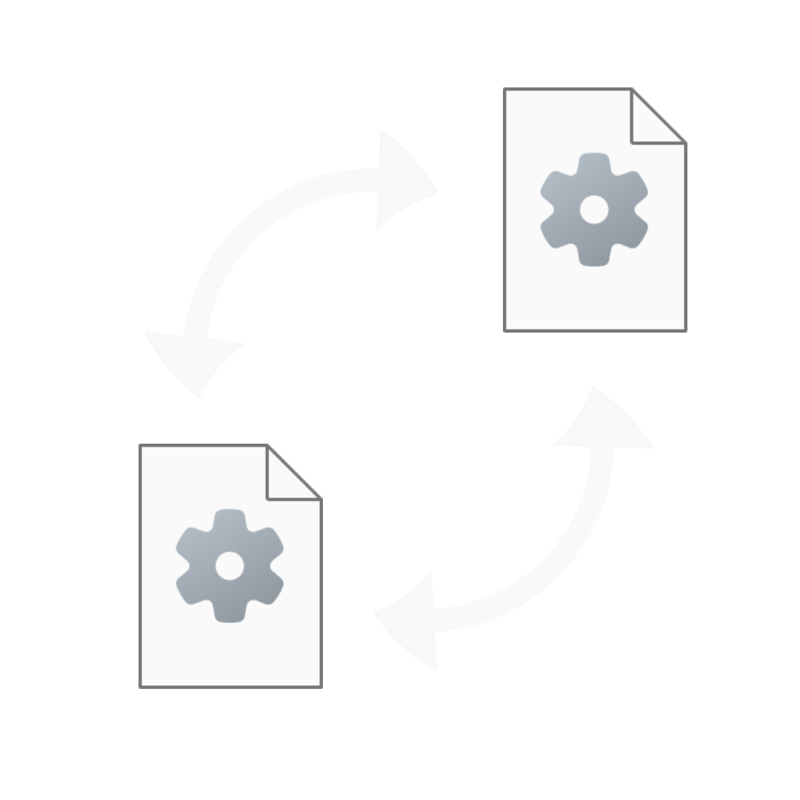
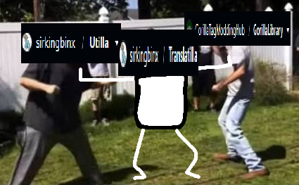

<div align="center">
    
    <h1>Translatilla</h1>
</div>

Translatilla is a (experimental) Gorilla Tag mod that heavily modifies [Utilla](https://github.com/sirkingbinx/Utilla) and [GorillaLibrary](https://github.com/GorillaTagModdingHub/GorillaLibrary) at runtime to get them to work together to implement modded lobby support.

Utilla or GorillaLibrary is declared as a "master library". The master library is the library that handles modded lobby functionality, and calls from the other library are translated to your master library and back in order to force compatability between both libraries without any compromises.

Translatilla requires little setup, just use the [Installation](#installation) steps and you get support for all of these features without any modification:
- custom gamemodes
- modded lobbies
- miscellanous utilities from both mod loaders

## Table of Contents



- [Installation](#installation)
- [Implementation & History](#implementation--history)
    - [Why](#why)
    - [How](#how)
- [Build](#build)
    - [CLI](#cli)
    - [Visual Studio](#visual-studio)
- [Configuration](#configuration)
    - [Master Library](#master-library)

<br clear="right"/>

## Installation
- Go to the [latest release](https://github.com/sirkingbinx/Translatilla/releases/latest) and download `Translatilla.zip`
- Extract the .zip file into your Gorilla Tag folder (that holds `Gorilla Tag.exe`).
- Launch the game with both Utilla and GorillaLibrary installed

## Implementation & History
### Why
In early 2026, [dev](https://github.com/developer9998), [Lapis](https://github.com/lapisgit), and several other notable modders formed the [Gorilla Tag Modding Hub](https://discord.gg/5rTmMjtECf) (GTMH) after splitting away from [Gorilla Tag Modding Group](https://discord.gg/monkemod) (GTMG) due to mishandling of allegations about a Verified Modder at that time. They built their own independent modding libraries (GorillaLibrary) which broke compatability with most mods that dependended on Utilla.

It left many modders and creators at a stopping point, forced to choose between a large community with official AA recommendation, and a smaller community but with many of the most popular mods in Gorilla Tag at that time.

To avoid modifying Utilla or GorillaLibrary to keep all groups of the modding community happy, Translatilla steps in and does heavy modifications at runtime with Harmony and BepInEx patchers to force the two to work together.

### How
In Translatilla's config file, a "master library" is set (either Utilla or GorillaLibrary). The master library is in charge of providing modded lobby services (gamemode selectors, code of conduct board info, and lobby management). Calls to the non-master library are translated into methods for the master library, and then those return values are translated to the non-master library types required by a mod, hence the name **transla**tilla.

The perks of modifying modded lobby management means that any misc calls (eg. for GorillaLibrary's cosmetic utilities) are able to run as normal without breaking mods that rely on those methods.

## Build
### CLI
```
git clone https://github.com/sirkingbinx/Translatilla
cd Translatilla
dotnet build # append "-C Release" to remove debug info
```
### Visual Studio
Load the solution in Visual Studio, right click the Translatilla solution, and select "Build Solution".

### Output
You can find all of the build artifacts in the `/Build/` folder. Inside you find the following:
- **Translatilla.zip**: Attached to every [release](https://github.com/sirkingbinx/translatilla/releases). Designed to be extracted directly into your BepInEx folder.
- **Translatilla.Patcher.dll**: Goes to `$(GAMEPATH)\BepInEx\patchers\`. Removes the incompatability attribute from GorillaLibrary so it will load.
- **Translatilla.Plugin.dll**: Goes to `$(GAMEPATH)\BepInEx\plugins\`. Patches Utilla and GorillaLibrary. This is where the bulk of the project is.

## Configuration
The configuration file is `$(GAMEPATH)\BepInEx\config\Translatilla.cfg`. You can open it with whatever you want, and it is formatted like any other BepInEx config file.

### MasterLibrary
> *Accepts: `GorillaLibrary`, `Utilla`*

The library responsible for modded lobby management. Mods for the non-master library are translated during runtime to support the other mod loader.
